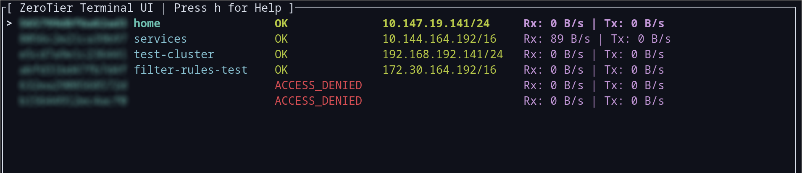
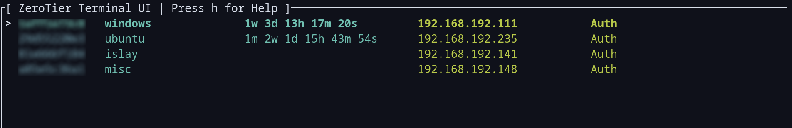

# ztui: your one-stop shop for ZeroTier terminal UI goodness

ztui aims to be a frontend for all interactions with ZeroTier in an attempt to
transform how people work with it. It provides the following features:

- Main Screen:
  - Bookmarks for Networks (disconnecting does not make the network id disappear from the list, and you can rejoin easily)
  - Interaction directly with Central members from the network list.
  - Joining, Leaving Networks
  - Per-Network bandwidth statistics
  - Bind arbitrary commands to keys that use a template to launch (see more on this below)
  - Review the network JSON formatted pretty
- Central / Member List:
  - Rename members
  - Auth, Unauth, and Delete members

Networks List View:

<center></center>

Members List / Network View:

<center></center>

## Configuring arbitrary commands

### Rules

- Command must not be mapped by existing commands
- Will be executed in a shell; quote accordingly

### Configuration Syntax

After you start `ztui` for the first time, `$HOME/.config.zerotier/settings.json` will be created for you with your last-saved network information. Now, what we want to do is create `$HOME/.config.zerotier/config.json` and add something like this to launch `tcpdump`:

```json
{
        "commands": {
                "1": "/bin/tcpdump -i %i"
        }
}
```

The `%i` denotes the ZeroTier network interface that relates to the network you are selecting when pressing the key. `%i` is the only supported format string right now.

In this case, it would allow me to press `1` over a network to `tcpdump` its interface; then I would control+C out of it to come back to `ztui`.

## Author

Erik Hollensbe <git@hollensbe.org>
